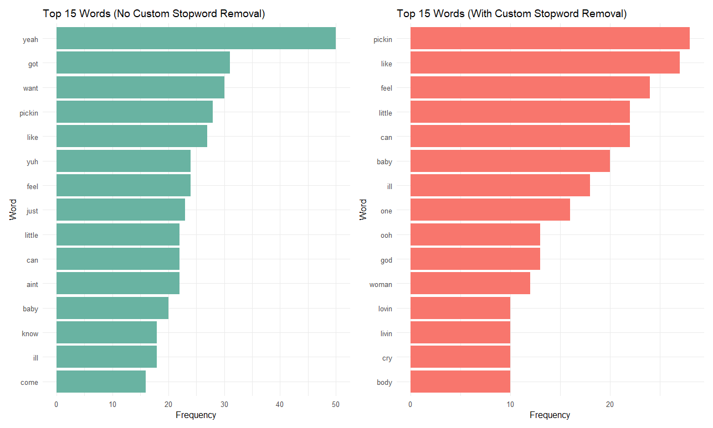
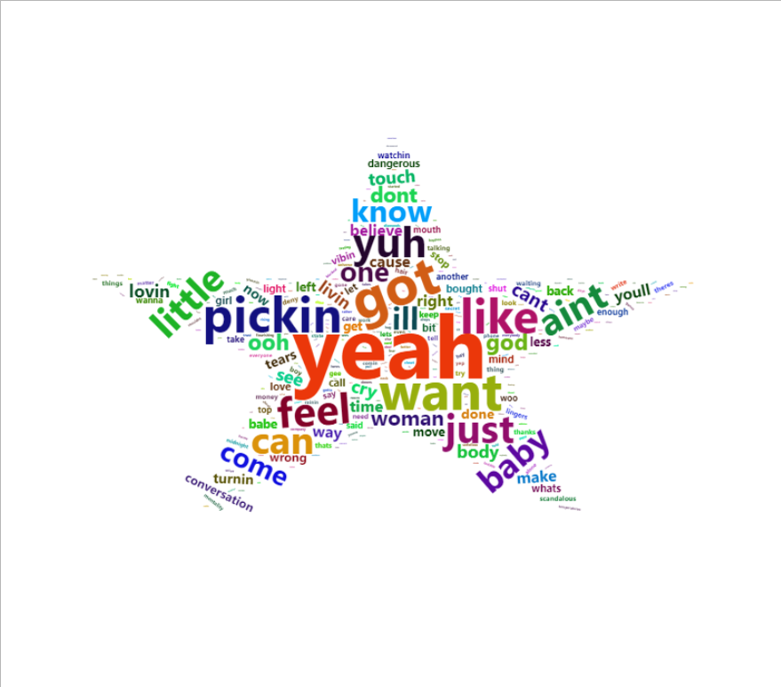
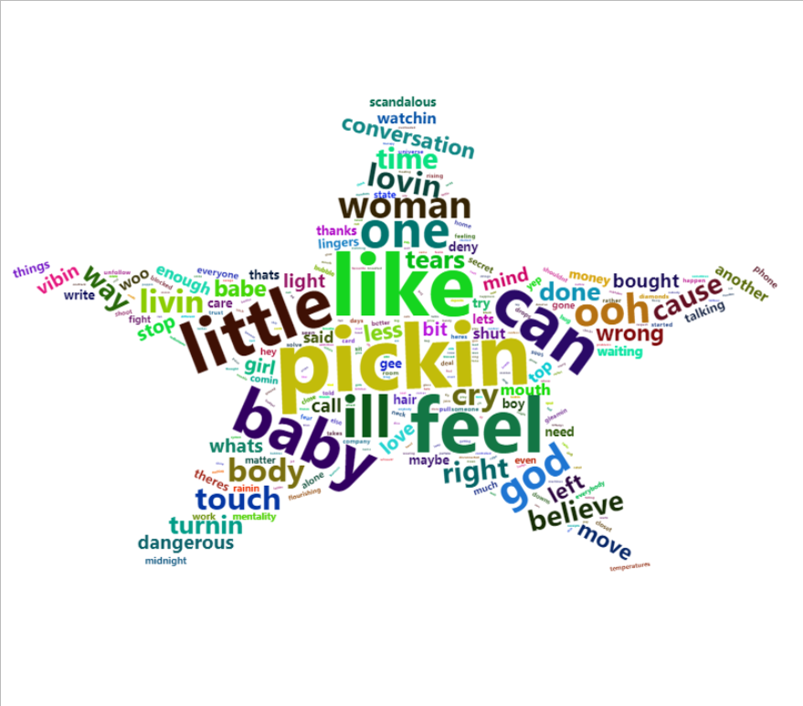
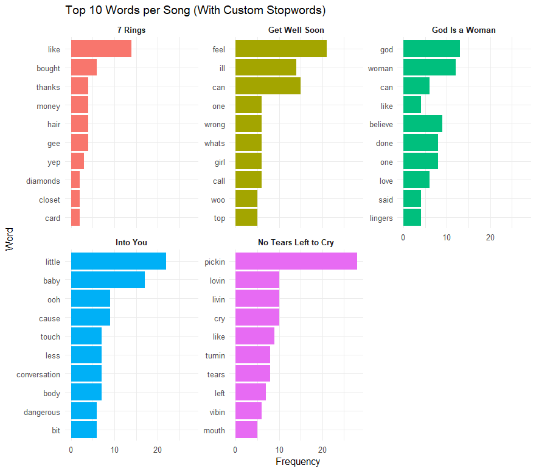
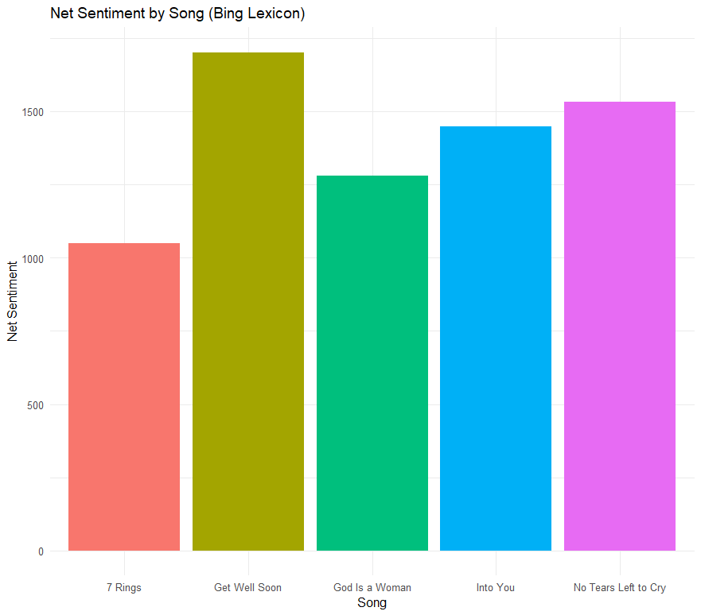
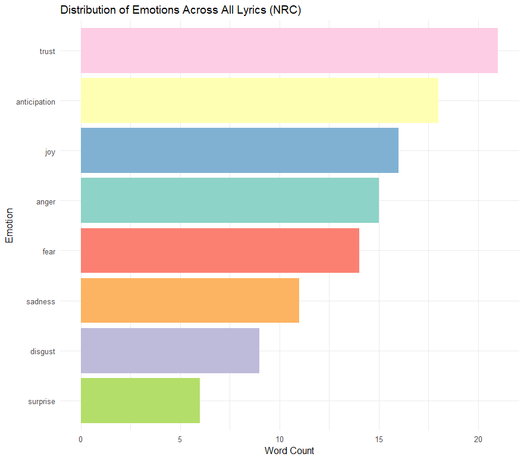

# 🎤 Ariana Grande Lyrics Analysis with NLP & Sentiment Techniques

  

  
  
  

---

## 📌 Overview

This project explores five popular **Ariana Grande** songs using **Natural Language Processing (NLP)** to understand emotion, tone, and stylistic patterns embedded in her lyrics. The project compares traditional stopword removal with custom stopword strategies to analyze how they influence interpretation and sentiment analysis.

---

## 🎶 Songs Included

| Song Title             | Theme                        |
|------------------------|------------------------------|
| 7 Rings                | Friendship & Empowerment     |
| No Tears Left to Cry   | Emotional Recovery           |
| Into You               | Romantic Desire              |
| God Is a Woman         | Feminine Power & Identity    |
| Get Well Soon          | Mental Health & Healing      |

---

## 🧰 Methods Used

- **Data Preprocessing**: Lowercasing, punctuation/number removal, whitespace stripping  
- **Stopword Handling**: Comparison of default stopwords vs. custom domain-specific list  
- **Visualizations**: Word clouds, bar plots, faceted word frequency  
- **Sentiment Analysis**:  
  - **Bing Lexicon** for polarity  
  - **NRC Lexicon** for emotion profiling  

---

## 🔍 Custom Stopword Strategy

| 🔹 Default Stopwords | 🔸 Custom Stopwords |
|---------------------|---------------------|
| e.g., the, is, and  | aint, gotta, yeah, want, just, im, get |

---

## 📊 Key Visualizations

### 📌 Top Words Comparison (Without vs With Custom Stopwords)

This comparison highlights the impact of using a **custom stopword list** when analyzing song lyrics.

- **Without custom stopwords**, the most frequent words are often casual or filler (e.g., *yeah*, *aint*, *got*, *just*, *im*). These are common in pop music but do not carry much analytical meaning.  
- **With custom stopwords**, we get a clearer view of the **core themes and emotional content** of the lyrics. Words like *feel*, *love*, *body*, and *god* become more prominent, enhancing the interpretability of the analysis.

  

---

### ☁️ Word Clouds

The word clouds below illustrate the most frequently used words across all five Ariana Grande songs.

- **Without custom stopword removal**, filler and informal words such as *yeah*, *aint*, *got*, and *just* dominate. These words are rhythmically important in lyrics but add noise in textual analysis.  
- **With custom stopwords removed**, the clouds reveal deeper, more meaningful vocabulary like *feel*, *love*, *baby*, and *god*. These highlight the core themes and emotions expressed in the songs more clearly.

| No Custom Stopwords | With Custom Stopwords |
|---------------------|------------------------|
|  |  |

---

### 💬 Top 10 Words by Song

The chart below presents the **top 10 most frequent words** for each individual song (with custom stopwords removed), helping to distinguish each track’s lyrical and emotional emphasis:

- **7 Rings** uses terms like *money*, *phone*, and *friends*, reinforcing themes of materialism and empowerment.  
- **Get Well Soon** centers around emotional language like *feel*, *wrong*, and *ill*, reflecting anxiety and healing.  
- **God Is a Woman** repeatedly uses *god*, *woman*, and *believe*, symbolizing feminine divinity and inner strength.  
- **Into You** includes sensual terms such as *touch*, *baby*, *body*, and *conversation*, reflecting romantic desire.  
- **No Tears Left to Cry** includes uplifting yet reflective words like *pickin*, *vibin*, and *lovin*, suggesting recovery from emotional pain.

  

---

## 📈 Sentiment Analysis Results

### 🟥 Bing Lexicon – Net Sentiment by Song

  

- **Get Well Soon** has the highest net positive sentiment  
- **7 Rings** shows the lowest, due to more assertive, bold terms  

---

### 🌈 NRC Emotion Lexicon – Emotion Distribution

  

- **Trust**, **Joy**, and **Anticipation** are most dominant  
- Negative emotions like **Fear** and **Sadness** are present but less prominent  

---

## 🧠 Insights

- Custom stopwords improve semantic clarity and reduce filler noise  
- Ariana Grande’s lyrics strongly convey **emotional resilience**, **empowerment**, and **healing**  
- NRC emotion profile confirms themes of **self-expression**, **confidence**, and **personal growth**  

---

## 👨‍🎓 Author 

**Author:** Azrul Zulhilmi Ahmad Rosli  
**License:** For academic purposes only.  
**Data Source:** Lyrics sourced manually or via lyric APIs for educational use.  
